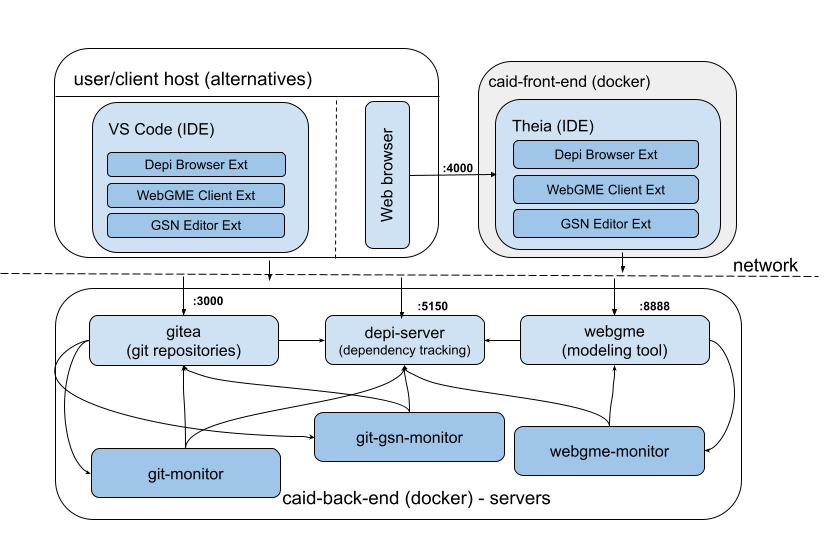
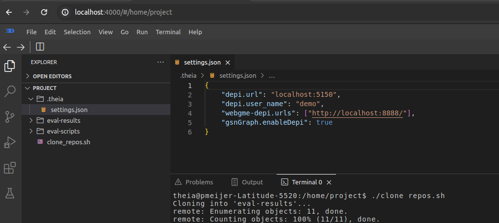
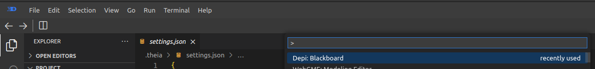
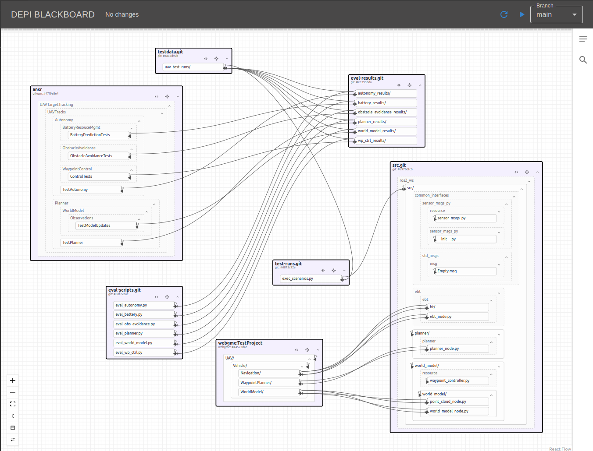
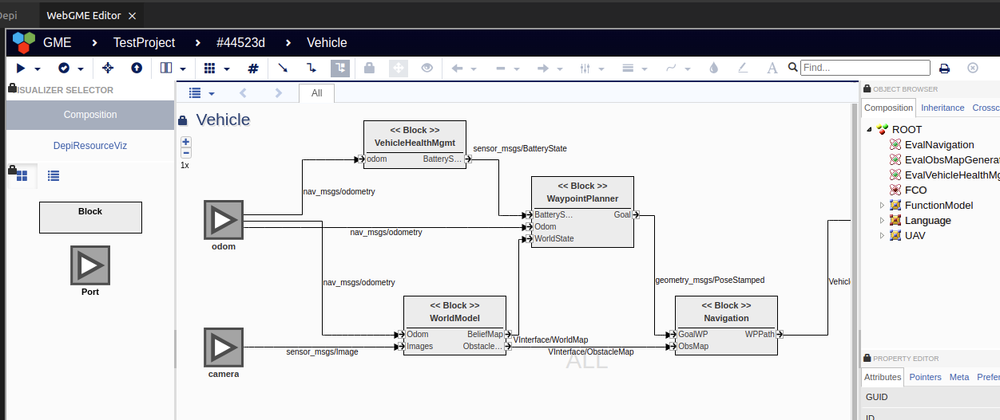
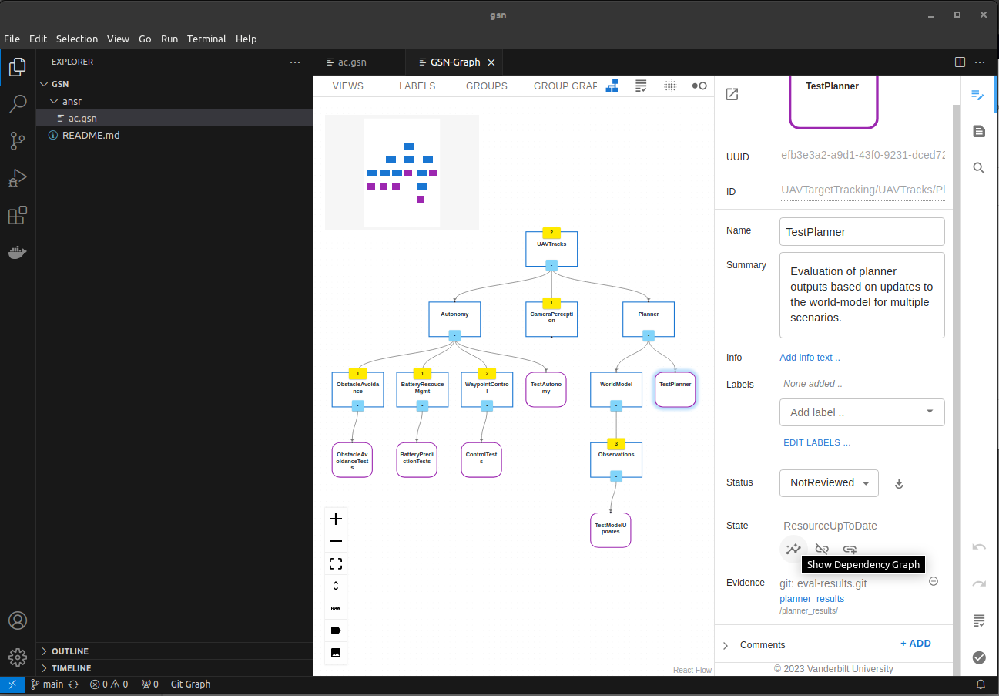
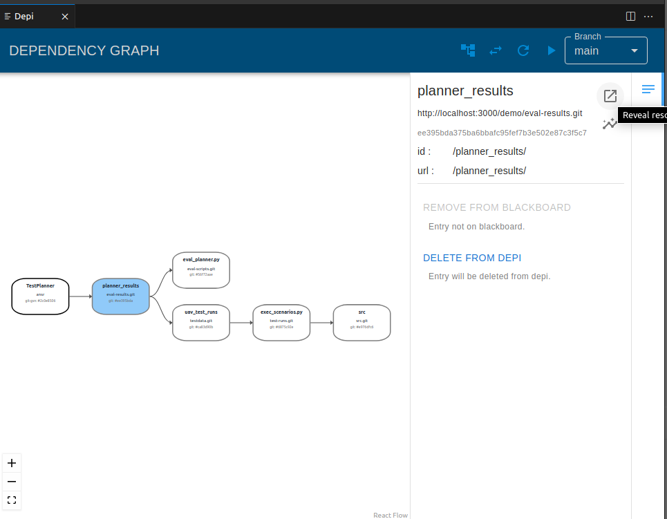

# CAID-tools
The CAID-tools are a software-suite for tracking dependencies across different types of tools and storages. At the core is the depi-server which provides a protocol for viewing, adding and linking resources (files, directories, models etc. in tools), reporting resource updates, etc. For each of the supported tools, there are user-interfaces (here implemented as vscode-extensions) and adapter/monitors that report resource updates. The currently supported tools are `git`, `git-gsn` and `webgme`.

In Depi, _Resources_ belong to a _Resource-Group_, and a _Resource-Group_ belongs to a _Tool_.
What exactly constitutes a _Resource-Group_ or a _Resource_ is specific to each individual _Tool_.
For example, in `git`, a _Resource-Group_ is a repository, and each _Resource_ is a file or
directory contained within that repository. Because each _Tool_ may have its own representation of
_Resource-Groups_ and _Resources_ there needs to be some external support for a new _Tool_
in the Depi.

First of all, there needs to be a way to add _Resources_ from that tool to the Depi
Blackboard. Once they are in the Depi Blackboard, a user can link those resources with
resources that belong to other tools. The other support necessary is a way to notify the
Depi server of changes in a _Tool_'s resources. For example, for `git` there is a script that
runs whenever code is pushed to a `git` repo. The script gives the Depi server a list of the
_Resources_ that have changed and what kind of change it was (add/rename/modify/delete). The
Depi then makes any necessary adjustments to its internal structures (for instance, changing the
name of a renamed resource), and also calculates what linked resources need to be examined.


| Tool | Resource-Group | Resources | Monitor | GUI / vscode-extension |
| --- | --- | --- | --- | --- |
| git | Git repository | File, Directory | git-monitor (git webhooks)| [Depi Browser](https://marketplace.visualstudio.com/items?itemName=vu-isis.depi) |
| git-gsn | GSN model directory inside a git repository | Solution nodes | git-gsn-monitor (git webhooks) | [GSN Editor](https://marketplace.visualstudio.com/items?itemName=vu-isis.gsn-assurance) |
| webgme | A WebGME project at a WebGME server instance | Model | webgme-monitor (webgme storage events) | [WebGME Client](https://marketplace.visualstudio.com/items?itemName=vu-isis.webgme-depi) |


## Repository structure
- `depi-impl` contains the source code for the depi-server, git-monitor, git-gsn-monitor, depi-cli and the depi vscode extension
- `examples` contains example models and utility scripts for docker (both for docker compose and the monolithic container)
- `gsn-domain` contains the source code for vscode extension GSN Editor which contains a grammar, LSP-server and a graphical editor for modeling assurance cases
- `webgme-depi` contains a vscode extension wrapping a webgme instance (and webgme components providing the interface between these two)

## Getting started
To try out the tool-chain we suggest using the prepared docker images, built to contain not only the software services but also the different resources for a small demo model of a UAV. If you haven't already, [install docker](https://docs.docker.com/engine/install/ubuntu/) - this has been tested with `Docker version 25.0.3, build 4debf41` on `Ubuntu 22.04`.

The docker image for the services referenced here is not made for production purposes for the following reasons:
 - The services and data is configured to be accessed via `localhost`
 - All data is persisted inside the container (if the container is removed all data is lost)
 - It goes againast [Docker's recommendation](https://docs.docker.com/config/containers/multi-service_container/) of only running one service per container

These are addressde in the [docker-compose.yml in the examples folder](/examples/docker-compose.yml). This can also more easily be modified to work with existing services (e.g. gitlab or github etc.) too.

### TL;DR
Back-end services:
```
docker run -d --name caid -p 3000:3000 -p 5150:5150 -p 8888:8888 git.isis.vanderbilt.edu:5050/aa-caid/caid-tools/caid-tools:latest
```
Front-end services:
```
docker run -d --name caid-fe -p 4000:4000 --network="host" git.isis.vanderbilt.edu:5050/aa-caid/caid-tools/caid-front-end:latest
```
Visit `http://localhost:4000` from your browser.

### Docker Images
The fasted way to get started is to use the monolithic docker image, `caid-tools`, that contains all the necessary back-end services for the provided example. For the user-interface, you can either [install vscode](https://code.visualstudio.com/download) directly on your machine or use the `caid-front-end` docker image that is using [theia](https://theia-ide.org/) (a server/web-browser based version of vscode) and already prepared with the extensions. 



### Back-end Services
Start the back-end services first using the monolithic docker-image based on the `Dockerfile` here in this directory.
```
docker run -d --name caid -p 3000:3000 -p 5150:5150 -p 8888:8888 git.isis.vanderbilt.edu:5050/aa-caid/caid-tools/caid-tools:latest
```

(To stop and restart the service `docker stop caid` and `docker start caid` respectively.)

The following services are running within the monolithic caid-tools container (see `examples/docker-compose.yml` for a more realistic deployment setup with individual containers for the different services).

- **depi-server** is the main server that tracks resources across different tools. In the monolithic Docker container, it persists the state in JSON files, which does not necessarily scale well. For non-demo purposes, the depi-server also supports [Dolt DB](https://github.com/dolthub/dolt) as a persistent layer.
- **git-monitor** is a small python server receiving webhook events from the git repositories and reports in the changes made to any git-resources in depi.
- **git-gsn-monitor** is similar to the git-monitor but instead of simply looking at the file changes, it builds up the models in memory and compares the ASTs between versions.
- **webgme-server** is a server for the metamodeling tool [WebGME](https://webgme.org/) that supports UML-like syntax for defining DSMLs such as SysML among other modeling languages.
- **webgme-monitor** is a small nodejs server receiving storage events from the webgme server. Just like the git based monitors it reports in any changes made to the, in this case webgme-resources, in depi.
- **gitea** is [a free, open source, git collaboration platform](https://about.gitea.com/) that hosts the git-repositories and manages the webhooks, etc.

### Front-end/User Interface
For the client user interface, you can either [install vscode](https://code.visualstudio.com/download) and then install the vscode extensions below (click link) or use the `caid-front-end` docker image below that is using [theia](https://theia-ide.org/) and already prepared with the extensions.

- [Depi Browser](https://marketplace.visualstudio.com/items?itemName=vu-isis.depi)
- [WebGME Client](https://marketplace.visualstudio.com/items?itemName=vu-isis.webgme-depi)
- [GSN Editor](https://marketplace.visualstudio.com/items?itemName=vu-isis.gsn-assurance)
  - This extension requires java 8+

#### Theia based image
Then the theia IDE with the extensions.
```
docker run -d --name caid-fe -p 4000:4000 --network="host" git.isis.vanderbilt.edu:5050/aa-caid/caid-tools/caid-front-end:latest
```

Once up and running go to: [http://localhost:4000](http://localhost:4000) using your browser (tested with Chrome).

#### VS-Code
To install the extensions you can either [search for them from within vscode](https://code.visualstudio.com/docs/editor/extension-marketplace) or simply click on the links above. Once installed you need to configure the extensions which is [explained here](examples/README.md#settings), (the monolithic service image only works with `localhost` as host).

If using a local copy of vscode, for the example do the following before going thru on Using the UI.
- clone this repo (or simply `examples/client/clone_repos.sh`)
- cd to `examples/client/`
- run the script `clone_repos.sh`
- open a vscode instance and open the folder `examples/client`
- follow the instructions as mentioned for theia (docker-based)

## Using the UI

Start out by cloning all the git-repositories that are part of this example. From the terminal in the bottom of the screen, invoke the `clone_repos.sh` script. 

This system consists of a system-model, modelled in webgme (where models are stored in a mongo-database), source code related to the blocks in the system-model, a few git-repositories with either test-scripts or generated data. Finally there is an assurance-model, modelled in GSN Assurance that is also stored under git (in the `ansr` folder in the `gsn` repository). However from Depi's perspective, these git-gsn files are managed slightly differently than regular git files where instead of being treated as regular files - the resources are acutal interpreted models defined in the code.

To view the current state of the example system press `Ctrl/Cmd + Shift + P` and start typing `Depi: Blackboard` and select the command. This will prompt you for a password to log into depi - the password for the `demo`-user is `123456`.


 In the picture below the different _Resource-Groups_ with their _Resources_ and _Links_ between them all expanded and displayed. The _Links_ are directionaly relationships are interpreted as "depends-on" (for example all resources of the `git-gsn` _Resource-Group_ `ansr` depends-on other _Resources_.)



### Reveal Resources
With _Resources_ added to Depi, it is possible to navigate (granted the _Tool_ supports) to the actual implementation of that resource. For example, by selecting the Vehicle in the `webgme` _Resource Group_. 

Expanding the side-menu, click the three lines to right-corner and then clicking the boxed arrow in the top right corner the Vehicle model is opened up in the WebGME model editor.

You can do the same thing for the git-based _Resources_ and if the repository is cloned locally it will open up the file in the vscode-editor (or expand and highlight the folder in the explorer).

### Show evidence and dependency chain
With the `.gsn`-file opened in the editor press `Ctrl/Cmd + Shift + P` and start typing `GSN: Graph View` and select the command. Expand the tree and navigate to the `TestPlanner` solution node.


Click on the `Show Dependency Tree` Button under the `State` section and the Depi Manager UI will opened up in a new tab displaying the 
dependency chain of the evidences associated with this Solution node.



# Acknowledgements
This work was supported by the DARPA Assured Autonomy program and Air Force Research Laboratory. Any opinions, findings, 
and conclusions or recommendations expressed in this material are those of the author(s) and do not necessarily reflect 
the views of DARPA or AFRL.

#### Contact
caid-dev@vanderbilt.edu