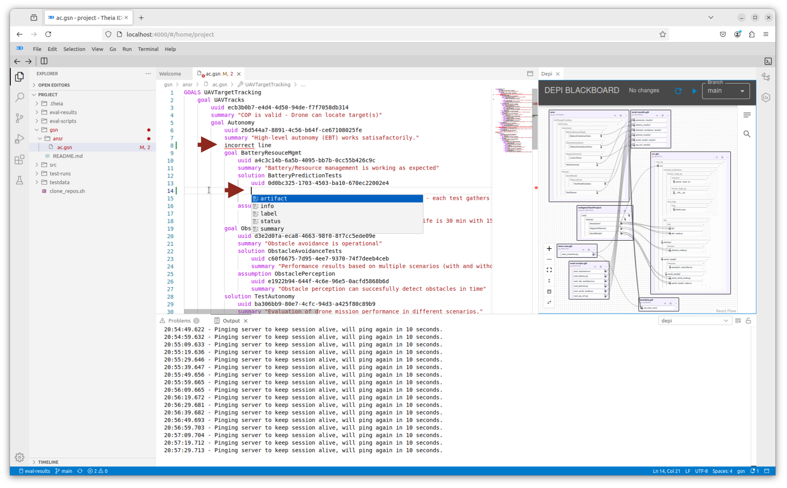
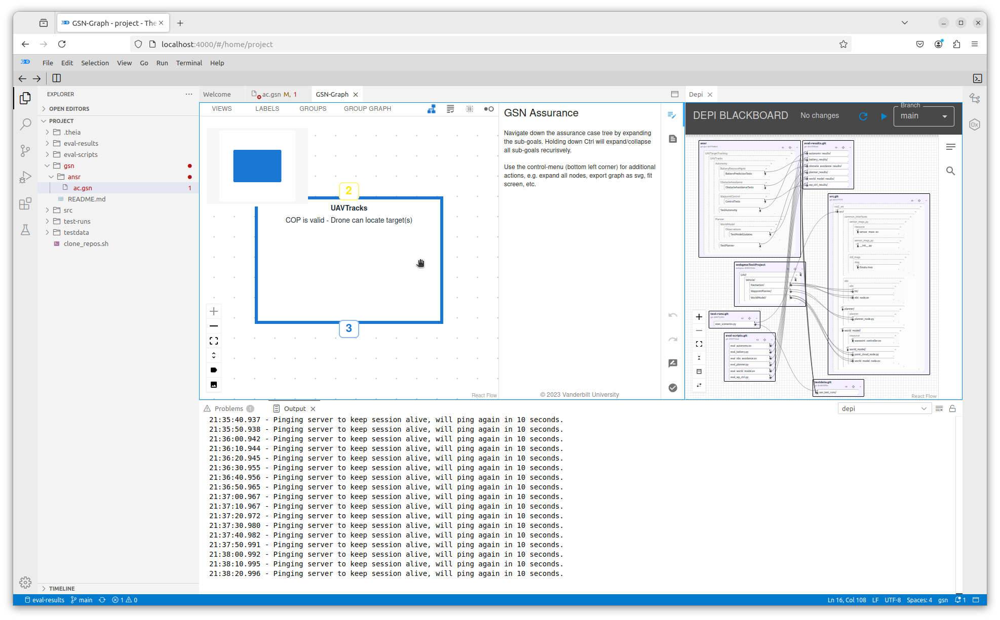
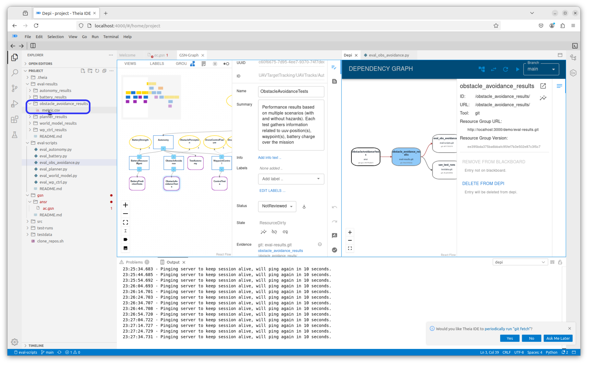
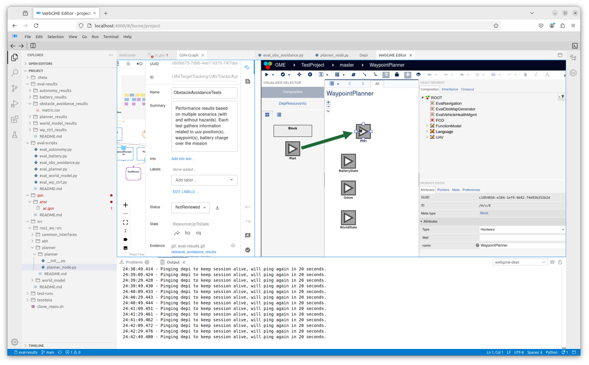

# CAID-tools Tutorial

A table of terms used in this tutorial is below:

| Term   | Definition                                  |
|--------|---------------------------------------------|
| CAID   | Continuous Assurance-Integrated Development |
| Git    | A distributed version control system        |
| GSN    | Goal Structured Notation                    |
| WebGME | Web-based Generic Modeling Environment tool |

## Introduction to CAID

When developing a control system, it is necessary to use different tools to
represent and work with different aspects of the system.  For instance, one may use
`WebGME` to model the system, `GSN` models to evaluate the system's reliability, and `Git`
to manage code that implements the system as well as code and data that is used to evaluate
the system for reliability.

| Tool   | Description                                                                                                                                                                    |
|--------|--------------------------------------------------------------------------------------------------------------------------------------------------------------------------------|
| WebGME | Used for graphically modeling complex systems.  Interpreters can traverse these models to generate any type of artifact, e.g. software source code that implements the models. |
| GSN    | Used to model and evaluate a system's reliability, generally in tree-form. Results of tests, e.g. on software generated by WebGME and managed by git, are represented in GSN.  |
| Git    | Used for source control of code and data for system implementation and system reliability evaluation.                                                                          |

When a change to the system is made in one of these tools, concomitant changes must be
made in the other tools so they remain in synchrony.  Thus, there are dependencies between these tools.

[CAID](https://github.com/vu-isis/CAID-tools) is used to manage the dependencies between these
different tools in order to keep their respective aspects of the system in synchrony.

This tutorial demonstrates the functionality of CAID.

## Starting the CAID Demo

When you first start the CAID demo, you may see what looks like a rocket ship.  This means the system
is still initializing:


When the system is done initializing, you will see this initial `Welcome` screen:


Open the `Explorer` pane by clicking on the Explorer Button

near the top left corner of the window:


The `Explorer` pane will appear on the left side of your browser window.

> NOTE:  The area to the right of the `Explorer` pane, where the `Welcome` is currently displayed,
> is called the `Editor` pane.  It is where graphs and the contents of various files will be displayed.

The directories displayed in the `Explorer` (all except `.theia`) are clones of git repositories whose
contents are interdependent.   The `clone_repos.sh` script was run in order to create them.  You can see
the contents of the `clone_repos.sh` script by clicking on it in the `Explorer`:


The repositories are listed in the below table:

| Repository       | Description                                                                                                                             |
|------------------|-----------------------------------------------------------------------------------------------------------------------------------------|
| src.git          | Source code for a UAV control system                                                                                                    |
| test-runs.git    | Source code for programs that test the UAV for proper functioning                                                                       |
| testdata.git     | Test input data for the UAV control system                                                                                              |
| eval-results.git | Test output data for the UAV control system                                                                                             |
| eval-scripts.git | Source code for programs that use the data from `testdata` and `eval-results` to evaluate the reliability of the UAV control system     |
| gsn.git          | `GSN` (Goal Structured Notation) models which use the results from the eval-scripts to build assurance cases for the UAV control system |

## The Depi

Implicitly, there are dependencies between the 6 repositories above.  For example:
* If there is a change in `src`, the `test-runs` must be rerun
* If the `test-runs` are re-run, the `test-data` must be used in these runs.
* If the `eval-scripts` are rerun, the `eval-results` must be updated
* If the `eval-results` are updated, the `gsn` model must be updated to reflect any new results.

Trying to manage these implicit dependencies manually would be labor-intensive and error-prone.

The Dependency Server, or `Depi`, is the component of CAID that makes these dependencies explicit,
recording them from user input and then managing them automatically.

In particular, the `Depi` will detect when a change is made to a particular resource and flag them
for manual update.  Because of this, the user can now keep track of what resources need to be updated.

### The Depi Blackboard

The dependencies between the various resources in the various git repositories can be viewed on the
`Depi Blackboard`.  To see the blackboard, click on the `Command Palette` button

in the upper right corner of your browser window:


In the resulting text field type the text below and press `<enter>`:

```commandline
>Depi: Blackboard
```

> NOTE:  The right chevron `>` in the above text is VERY IMPORTANT.

> NOTE: To get this same text field to appear, you can press Ctrl-p (press and hold the control-key
> while pressing the "p" key).  Note that Ctrl-Shift-p will **not** work for the CAID tool when it is
> used in a browser, as it is here.

> NOTE: As you type, selections will appear in a drop-down menu below the text field.  To get the
> `Depi Blackboard` to appear, you may either type in all of the text as above
> followed by the `<enter>` key, or click on the `Depi: Blackboard` selection with your primary mouse
> button when it appears.


The `Depi Blackboard` will be displayed in a sub-pane in the right side of the `Editor` pane:


In the `Depi Blackboard`, you will see rectangles that correspond to each of the repositories listed
above.

Note that there is one rectangle that does not correspond to any of the above repositories:
`webgme:TestProject`.  This rectangle represents a WebGME model of the UAV, called `TestProject`.
In particular, it models all of the components of the UAV, e.g. rotors, batteries.

Clicking on the `expand` button
()
in any of these rectangles will reveal some content of the corresponding repository.  The `expand` button will
appear next to revealed content, and clicking on it here will reveal more content.


### The Dependency Graph

To see a graph of the dependencies between all of the resources in all of the repositories, click on the
`expand all resource groups` button
()
near the lower left corner of the `Depi Blackboard` sub-pane:


Currently, you show only be able to see a segment of the dependency graph shown in the sub-pane.  To
see the entire graph, click the `fit view` button
()
near the lower left corner of the sub-pane:


From this graph, we can see that, indeed:
1. A script in `test-runs` depends on the code in `src`
1. The `test-data` depends on the `test-runs` to simulate the UAV with the `test-data`
1. The `eval-results` depends on `eval-scripts` to be regenerated
1. A `ansr` gsn model depends on the `eval-results` for its assurance case

## Visualizing Dependencies using the `Depi`

In addition to visualizing the dependencies between resources in a project, the `Depi` can also be used
to visualize the dependencies of a particular resource.

Here, we will visualize the dependencies of a `solution` node in a GSN (Goal Structured Notation) model.

Before we do this, please click on the `clone_repos.sh` tab at the upper left corner of the left
sub-pane of the `Editor` pane:


This will cause new information in the next section of this tutorial to appear in the left sub-pane
of the `Editor` pane, leaving visible the Dependency Graph in the right sub-pane.

### Goal Structured Notation

Before visualizing dependencies, we will get acquainted with the features of CAID for working with
GSN models.  This includes:

* Working with the text representation of GSN models
* Working with the graph representation of GSN models
* Automatic synchronization between the text and graph representations performed by CAID

#### The Text Representation of GSN Models

By clicking on `gsn` in the `Explorer`, and then clicking on `ansr` underneath it, you'll expose the
`ac.gsn` file.  Click on this file to show its contents in the left sub-pane of `Editor` pane.


`ac.gsn` contains the text representation of a `GSN` model used to evaluate the reliability
of a software system.  Such a model is called an _assurance case_.  This representation consists of
one or more lines that start with a keyword, followed by information that relates to the keyword.

A `GSN` model is in the form of a tree, and in the text representation lines that start with `goal` or
`solution` correspond to nodes of this tree.

The lines immediately under and indented from a `goal` or `solution` line are the corresponding node's
contents.

> NOTE:  There are also `assumption`, `context`, and `justification` nodes in the GSN model, but they
> are not tree nodes.  They are associated with tree nodes, i.e. are part of their contents, but they
> are not internal or leaf nodes of the tree.

> NOTE:  `Goals` in an assurance case are also called `Claims`.

##### The Language Server

> NOTE: Do not make the modifications to the GSN model text in this section of the tutorial.
> These modifications are shown only for demonstration.

One feature of CAID is that, when editing the text representation of a `GSN` model, a language server
will indicate the locations of syntax errors and suggest completions for words when
`Ctrl-SPACE` is pressed on the keyboard, as indicated by the red arrows in the figure below:



Suggestions also appear after you type one or more characters:


> NOTE: Do not make the above modifications.  If you did, please undo them.  They are shown only for
> demonstration.

#### The Graph Representation of GSN models

To see a graphical depiction of this GSN model, click on the

at the top right of the browser window as was done to launch the `Depi Server` above,
and in the resulting text field, enter the following text and press the `<enter>` key:

```commandline
>GSN: Graph View
```

> NOTE:  Again, the right chevron `>` in the above text is VERY IMPORTANT.


The GSN Graph View will appear in the left sub-pane of the `Editor` pane:



To make more room for the GSN model graph, click on the `Info` button

at the upper right corner of this sub-pane:


What is shown is not the whole tree of the GSN model, but only the root node.  For this or any node
displayed in the graph view, the upper yellow number indicates the number of assumptions, contexts,
and justifications for the node.  The lower blue number indicates the number of children, i.e.
sub-goals and solutions, the node has.

The graph view is interactive, so to see the assumptions and contexts, click on the yellow number:


Click on the same spot (now cyan with a dash `-` in it) to hide the assumptions and contexts.

To see the node's children, click on the blue number:


As with the assumptions, you can click on the same spot to hide the children.

To see the entire tree of the GSN model, click on the `Expand Tree` button
()
at the lower left corner of the `Editor` pane:


In this model, a `solution` node (purple rectangle) represents evidence that supports their parent `goal`
(`claim`) node. One or more `goal` nodes that are siblings in the tree support their parent `goal` node.  The
desired end state is that all `goals` are supported by `solutions` or other `goals` all the way up
to the root `goal`.  At this point, the reliability of the system is proven.

The types of nodes in the graph are as follows:

| Node type     | Description                           |
|---------------|---------------------------------------|
| Assumption    | Yellow ellipse                        |
| Context       | Yellow rectangle with rounded corners |
| Justification | Orange Ellipse                        |
| Goal          | Blue rectangle                        |
| Solution      | Purple rectangle with rounded corners |

##### Alternate Views of the GSN Model

The tree view is one of several views that are available for the GSN model using CAID.  The others
are presented below.

###### Table view

To see the table view of the GSN model, click on the `Review Table` button
 near the
right top corner of the `Editor` pane:


You can see a table of goals (claims) for this GSN model, or, as can be seen in the upper right corner
of this view, by clicking the selector button for `Solution` you can see a table of solutions.


###### Radial View

The radial view of the GSN model can be seen by clicking on the `Radial Visualization` button

to the right of the `Review Table` button:


In this view, the root node of the GSN model is in the middle, and the descendant nodes radiate out
from the root node.

###### Cluster View

To see the cluster view of the GSN mode, click on the `Cluster Visualization` button

to right of the `Radial Visualization` button:


The cluster view is similar to the radial view inasmuch as the root node of the GSN model is displayed
in the middle, and the descendant nodes radiate out from the root node.  However, the descendant nodes,
at a given selectable depth, are displayed in circular clusters.

The default `Clustering Depth` is 2, as shown in the above figure.  However, you can select a
different clustering depth at the lower left corner of the `Editor` pane.  Below is a cluster view
of the GSN model with a clustering depth of 4:


To get back to the tree view, click on the `Tree Graph Visualization` button

to left of the `Review Table` button:


#### Synchrony between the Text and Graph Representations of the GSN Model

One feature of the text and graph representations of a GSN model in CAID is that modification in one
will be reflected in the other.

To demonstrate this, click on the `ac.gsn` tab at the top left of the `Editor` pane to go back to the
text representation of the GSN model.  Then, scroll down to expose the `WaypointControl` node starting
at line 29.


Now, click the `GSN-Graph` tab to show the graph representation again.  Locate the `WaypointControl`
node, and click on it with your primary mouse button so that it is highlighted:


Then click on the `info` button

at the upper right corner of the Graph View.

A sub-pane pertaining to the `WaypointControl` node will appear on the right of the Graph View:


Scroll down to the bottom of this sub-pane and click on `+ Goal`.  A new goal (blue rectangle)
labeled `G1` will appear below the `WaypointControl` node in the Graph View:


Clicking again on the `ac.gsn` tab, we see in the text representation that a new goal called `G1` has
appeared in the contents of the `WaypointControl` node:


Select this new `G1` goal and its contents with your mouse and press the `delete` key on your keyboard
to delete it:


Select the `GSN-Graph` tab again, and notice the `G1` goal has been deleted from the tree as well.


### Working with Dependencies

In a GSN model for proving the reliability of a control system, called an `assurance case`, the
`solution` (leaf) nodes provide evidence of the reliability of some component of the system.
However, this evidence is generally not contained in the GSN model itself.  Rather, the `solution` node
is a representation of this evidence, and the evidence is stored elsewhere.

Thus, there is a dependency between the GSN model `solution` node and its evidence:  if the evidence changes,
the `solution` node must be updated.

As well, there are resources, i.e. data and programs, that are used to generate the evidence, and thus a
dependency between the evidence and these resources -- if one or more of these resources change, the
evidence must change (i.e. be updated).  These resources are stored in still other locations.

CAID keeps track of these dependencies, and using the facilities of CAID, we can find all of the dependencies
of a particular resource in our project.

Also, CAID will flag a resource if any of its dependencies change.  This is to remind a developer to review
the resource and perform any updates to keep it in synchrony with its dependencies.

#### Finding the Dependencies of a Project Resource

In this section, we will find all of the dependencies of a particular resource in our project, and in particular
of a `solution` node in the gsn model.

Firstly, make sure the `GSN-Graph` tab is selected in the left sub-pane of the `Editor` pane.

Click on the `ObstacleAvoidanceTests` `solution` node in the GSN graph -- we will find the dependencies of this node.


A sub-pane to the right of the graph should now contain information about the `ObstacleAvoidanceTests`
node.

> NOTE:  If the sub-pane is not visible, click on the `info` button
> 
> at the upper right corner of Graph View.

> NOTE:  Scroll to the top of this sub-pane if needed to see that its information pertains to the
> `ObstacleAvoidanceTests` node.

Scroll down to the bottom of this sub-pane to reveal the `Show Dependency Graph` button
.

Click on this button to display the dependency graph for the ObstacleAvoidanceTests `solution` node.
This graph will appear in its own sub-pane on the right of the `Editor` pane:


In this graph, we see that the ObstacleAvoidanceTest `solution` node at the left, which is in the `gsn.git` repository,
depends on other resources in our project that are contained in other git repositories.  This is indicated by
the arrowed lines:

| Dependency                 | Type     | Location         |
|----------------------------|----------|------------------|
| obstable_avoidance_results | Direct   | eval-results.git |
| eval_obs_avoidance.py      | Inferred | eval-scripts.git |
| uav_test_runs              | Inferred | testdata.git     |
| exec_scenarios.py          | Inferred | test-runs.git    |
| src                        | Inferred | src.git          |

Click the `eval_obs_avoidance.py` dependency, and it will turn blue to show that it is selected.  Note that this
is an _inferred_ (indirect) dependency of the ObstacleAvoidanceTest `solution` node.


Then, click on the `Dependency Info` button

at the upper right of the dependency graph:


The resulting sub-pane shows information about the `eval_obs_avoidance.py` dependency. In this sub-pane,
click the `Reveal resource` button

at the upper right:


This will display the contents of the `eval_obs_avoidance.py` file in the right sub-pane of the `Editor` pane.  It
also highlights the `eval_obs_avoidance.py` file as part of the `eval-scripts` git repository in the `Project` pane
at the left of the window.


The other dependencies of the `ObstacleAvoidanceTests` `solution` node of the GSN model as shown in the
dependency graph can be viewed using this same procedure.

#### Updating a Resource when its Dependencies Change

All resources in a project managed by CAID reside in source control repositories.  In particular, all
resources besides WebGME models reside in `git` repositories.  `WebGME` also provides revision control, though not by
using `git`.

When a change is made to a resource in CAID, it must be committed and pushed to the `main` branch of its `git`
repository for CAID to detect it (or, in the case of `WebGME`, committed to the `master` branch).  Once this is done,
CAID will flag for review all resources for which the resource is a dependency.  This is to remind a developer to
check these resources and make necessary changes to keep them in synchrony with the dependency.

##### Modifying the `eval_obs_avoidance.py` Dependency

We will now make changes to a dependency of the `ObstacleAvoidanceTests` `solution` node in the GSN graph, and use
CAID to find the resources that need to be updated as a result.

Continuing from the last section, in the right sub-pane of the `Editor` pane, make sure the `eval_obs_avoidance.py`
tab is selected.  Suppose `eval_obs_avoidance.py` is modified to include enhancements and bug fixes.  We will
not actually make such modifications here, but will instead add a comment to represent such changes:


Note that, once you've made this modification:

1. The `eval_obs_avoidance.py` tab on the right side of the `Editor` pane, as well as the `eval_obs_avoidance.py` file
   item in the `Explorer` pane on the left side of the browser window, will both have an `M` on their right side.
   This is to indicate that the `eval_obs_avoidance.py` file has been modified.
1. The `eval-scripts` folder item in the `Explorer` pane has a red dot on its right side.  This is to indicate that
   one or more files in this folder have been modified.
1. The `Source Control` button
   
   near the upper left corner of the browser has a blue dot with a `1` in it at its lower right corner.  This
   is to indicate that `1` file has been modified in the `eval-scripts.git` repository, of which the `eval-scripts`
   folder is the root folder.

##### Committing the Modification

To commit the change to the `eval-scripts.git` repository, click on the `Source Control` button.  This will cause
the `SOURCE CONTROL: GIT` pane to appear on the left side of the browser window:


By hovering over the `CHANGES` line in this pane, the `Stage All Changes` button

will appear.  Click on this button to stage the modification to the `eval_obs_avoidance.py` file:


Enter a commit message in the `Message` textbox, and then click on the `Commit` button
:


A thin blue line will appear above the `Message` textbox for a few seconds.  Once it is no longer visible, the
commit is complete.

Now, click on the `More Actions ...` button

located to the right of the `Commit` button, and in the resulting drop-down menu, select 'Push':


In the resulting pop-up menu, select the `eval-scripts` repository:


Again, a thin blue line will appear above the `Message` textbox for a few seconds.  Once it is no longer visible, the
push is complete.

##### Bringing the Resources into Synchrony

Now, click on the `Depi` tab in the right sub-pane of the `Editor` pane:


The dependency graph for the `ObstacleAvoidanceTests` `solution` node is again displayed.

> NOTE: To see the whole graph, you can click on the `Dependency Info` button
> 
> at the upper right of the graph to hide the information pane at the right.
> 
> If you do this, be sure to click it again to display the information pane.  We will need this for what follows.

Notice that two of the dependency links (arrowed lines), in particular those upstream from `eval_obs_avoidance.py`,
are now colored red.  This indicates that these dependencies are `Dirty`, and the nodes incident on them,
`obstacle_avoidance_results` and `ObstacleAvoidanceTests` (the `solution` node in the GSN graph), should be
reviewed and perhaps modified to bring them in synchrony with the modified `eval_obs_avoidance.py` file.

If you click on the dependency link between the `obstacle_avoidance_results` and `eval_obs_avoidance.py` nodes,
it will turn light-blue, and information about the dependency will appear in the information sub-pane to the right:


This information shows that there is a direct dependency between `obstacle_avoidance_results` and
`eval_obs_avoidance.py`, and that it is `Dirty`.

If we click on the link between `ObstacleAvoidanceTests` and `obstacle_avoidance_results`, we see this link is also
`Dirty` due to the modified `eval_obs_avoidance.py` file, but that the dirtiness is indirect, or _inferred_,
through `obstacle_avoidance_results`.


Let us first bring `obstacle_avoidance_results` in synchrony with the `eval_obs_avoidance.py` modifications.

As we did with the `eval_obs_avoidance.py` node:
* Click on the `obstacle_avoidance_results` node
* In the information sub-pane on the right, click on the `Reveal resource` button
  :

Because `obstacle_avoidance_results` is a folder, the `Reveal resource` button only reveals its contents
in the `Explorer` pane on the left side of the browser window. To see the contents of the file `metric.csv`
in the `Editor` pane, you will need to click on it in the `Explorer`:



To bring the data in `obstacle_avoidance_results` into synchrony with the `eval_obs_avoidance.py`, we will edit the
`metric.csv` file.  For this tutorial, let's say this is done by changing the `metric2` value to 75:


We will also commit and push this modification to the `main` branch of the `eval-results` repository in the same
way as the `eval_obs_avoidance.py` file above (use an appropriate commit message):


Once the push is complete, again click on the `Depi` tab in the right sub-pane of the `Editor` pane, and click
on the dependency link between `obstacle_avoidance_results` and `eval_obs_avoidance.py`.  Now that the
`obstacle_avoidance_results` has been modified to be in synchrony with `eval_obs_avoidance.py`, we can mark this
dependency as `clean` by clicking the `Mark as clean` button
:


Note that dependency link between `obstacle_avoidance_results` and `eval_obs_avoidance.py` is no longer dirty:


and if you click on the white background in the `Dependency Graph` sub-pane, this link is no longer red:


Click on the dependency link between `ObstacleAvoidanceTests` and `obstacle_avoidance_results` again, and note
that it is now dirty in two ways:

* The _inferred_ dirtiness from the modification to `eval_obs_avoidance.py`
* The direct dirtiness from the modification to `obstacle_avoidance_results`


When the appropriate modifications are made to the `ObstacleAvoidanceTests` `solution` node, we can click the
`Mark as clean` button

for both of these forms of dirtiness to complete our dependency review:


### CAID and WebGME

WebGME can be used to model control systems graphically.  The advantage of WebGME is that interpreters can be written,
in JavaScript or Python, to traverse a WebGME model and program code that implements the
model.  This code is then stored in one or more files.  To learn more about WebGME, click
[this link](https://webgme.org/).

WebGME is integrated into CAID so that it can be executed and used in the `Editor` pane, and, as well, the 
dependencies between WebGME model components and the code files it generates can be managed.

The following example shows one means of accessing WebGME using CAID.

Open the `Depi Blackboard` as we did in [The Depi Blackboard Section](#the-depi-blackboard) above,
with all of the dependency links displayed, and notice that the dependencies between resources in the
`webgme:TestProject` WebGME model and the `src.git` repository:


Note that these are _circular_ dependencies, i.e. a resource in the `src.git` repository
(e.g. the `planner_node.py` file) has a resource in the `webgme:TestProject` WebGME model
(e.g. the `WaypointPlanner` component) as a dependency, and this same resource in the
`webgme:TestProject` WebGME model has the same resource in `src.git` as a dependency.

This is because the WebGME model, which is of a control system, is used to generate source code into
`src.git` that implements this control system.  If a WebGME model component changes, the file that
contains the code it generates needs to be updated so that they remain in synchrony.

As well, if a file is updated (independently, i.e. not due to a change in the WebGME model), the corresponding
component in the WebGME model should be updated.

We can view the dependency graph a particular component/file pair by expanding the `src` repository in the
`Explorer` pane until we can see one of the source files.  For this tutorial, we will use `planner_node.py`.

> NOTE:  Click on the Explorer Button

near the top left corner of the browser window to view the `Explorer` pane.

Click on this file using the secondary mouse button, and in the resulting pop-up menu, select
`Show Dependency Graph`


The dependency graph will appear in the right sub-pane of the `Editor` pane.  To launch WebGME and view the
`WaypointPlanner` component of the WebGME model:
* Click on the `WebpointPlanner` node in the dependency graph (it will turn blue to indicate that it is selected)
* Click on the `Dependency Info` button
  
  at the upper right of the dependency graph 
* In the `Dependency Info` pane, click the `Reveal resource` button
  


The WebGME Editor, with `WaypointPlanner` seleced, will appear in the right sub-pane of the `Editor` pane:


To modify the `WaypointPlanner`, click on the name of the WebGME model, `TestProject` for this example, at the
top of the WebGME Editor.  In the resulting drop-down menu, click on `ProjectHistory`:


In the pop-up window, click on `master`:


Then click the `Close` button in the lower right corner:


Now, modify the `WaypointPlanner` component of the WebGME model by clicking and dragging a `Port`

from the `Part List` on the left into the `WaypointPlanner` sub-pane:



Now that the `WaypointPlanner` has been modified, click on the `Depi` tab on the right sub-pane of the `Editor`
pane:


Notice that the dependency links in the dependency graph are now red to indicate that the `planner_node.py` file
may need to be modified to bring it into synchrony with the `WaypointPlanner` component of the WebGME model.  This
situation can be managed as in the
[Updating a Resource when its Dependencies Change Section](#updating-a-resource-when-its-dependencies-change) section.

> NOTE:  WebGME can be executed at any time by entering `>WebGME: Modeling Editor` into the `Command Palette`:
> 
