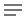

# CAID-tools Tutorial

A table of terms used in this tutorial is below:

| Term   | Definition                                  |
|--------|---------------------------------------------|
| CAID   | Continuous Assurance-Integrated Development |
| Git    | A distributed version control system        |
| GSN    | Goal Structured Notation                    |
| WebGME | Web-based Generic Modeling Environment tool |

## Introduction to CAID

When developing a control system, it is necessary to use different tools to
represent and work with different aspects of the system.  For instance, one may use
`WebGME` to model the system, `GSN` models to evaluate the system's reliability, and `Git`
to manage code that implements the system as well as code and data that is used to evaluate
the system for reliability.

| Tool   | Description                                                                                                                                                                   |
|--------|-------------------------------------------------------------------------------------------------------------------------------------------------------------------------------|
| WebGME | Used for graphically modeling complex systems.  Interpreters can traverse these models to generate any type of artifact, e.g. software source code the implements the models. |
| GSN    | Used to model and evaluate a system's reliability, generally in tree-form. Results of tests, e.g. on software generated by WebGME and managed by git, are represented in GSN. |
| Git    | Used for version control for code and data for system implementation and system reliability evaluation.                                                                       |

When a change to the system is made in one of these tools, concomitant changes must be
made in the other tools so they remain in synchrony.  Thus, there are dependencies between these tools.

[CAID](https://github.com/vu-isis/CAID-tools) is used to manage the dependencies between these
different tools in order to keep their respective aspects of the system in sync.

This tutorial demonstrates the functionality of CAID in this regard.

## Starting the CAID Demo

When you first start the CAID demo, you may see what looks like a rocket ship.  This means the system
is still initializing.

<br/><br/>

When the system is done initializing, you will see this initial screen:

<br/><br/>

Open the `Explorer` pane by clicking on the Explorer Button 
near the top left corner of the window:

<br/><br/>

The `Explorer` pane will appear on the left side of your browser window.

> NOTE:  The area to the right of the `Explorer` pane is called the `Editor` pane.  It is where
> graphs and the contents of files will be displayed.

The directories displayed in the `Explorer` (all except `.theia`) are clones of git repositories whose
contents are interdependent.   The `clone_repos.sh` script was run in order to create them.  You can see
the contents of the `clone_repos.sh` script by clicking on it in the `Explorer`:

<br/><br/>

The repositories are listed in the below table:

| Repository   | Description                                                                                                                             |
|--------------|-----------------------------------------------------------------------------------------------------------------------------------------|
| src          | Source code for a UAV control system                                                                                                    |
| test-runs    | Source code for programs that test the UAV for proper functioning                                                                       |
| testdata     | Test input data for the UAV control system                                                                                              |
| eval-results | Test output data for the UAV control system                                                                                             |
| eval-scripts | Source code for programs that use the data from `testdata` and `eval-results` to evaluate the reliability of the UAV control system     |
| ansr         | `GSN` (Goal Structured Notation) models which use the results from the eval-scripts to build assurance cases for the UAV control system |

## The Depi

Implicitly, there are dependencies between the 6 repositories above.  For example:
* If there is a change in `src`, the `test-runs` must be rerun
* If the `test-runs` are re-run, the `test-data` must be used in these runs.
* If the `eval-scripts` are rerun, the `eval-results` must be updated
* If the `eval-results` are updated, the gsn must be updated to reflect any new results.

Trying to manage these implicit dependencies manually would be labor-intensive and error-prone.

The Dependency Server, or `Depi`, is the component of CAID that makes these dependencies explicit,
recording them from user input and then managing them automatically.

In particular, the `Depi` will detect when a change is made to a particular item and then either
automatically update the item's dependencies or flag them for manual update.  In the latter case,
the user can now keep track of what items need to be updated.

### The Depi Blackboard

The dependencies between the various items in the various git repositories can be viewed on the
`Depi Blackboard`.  To see the blackboard, click on the `Command Palette` button

in the upper right corner of your browser window:


In the resulting text field type the text below and press `<enter>`:

```commandline
>Depi: Blackboard
```

> NOTE:  The right chevron `>` in the above text is VERY IMPORTANT.

> NOTE: To get this same text field to appear, you can press Ctrl-p (press and hold the control-key
> while pressing the "p" key).  Note that Ctrl-Shift-p will not work for the CAID tool when it is
> used in a browser, as it is here.

> NOTE: As you type, selections will appear in a drop-down menu below the text field.  To get the
> `Depi Blackboard` to appear, you may either type in all of the text as above
> followed by the `<enter>` key, or click on the `Depi: Blackboard` selection with your primary mouse
> button when it appears.


The `Depi Blackboard` will be displayed in a sub-pane in the right side of the `Editor` pane:


In the `Depi Blackboard`, you will see rectangles that correspond to each of the repositories listed
above.

Note that there is one rectangle that does not correspond to any of the above repositories:
`webgme:TestProject`.  This rectangle represents a WebGME model, called `TestProject`, of the UAV.
In particular, it models all of the components of the UAV, e.g. rotors, batteries.

> NOTE: Clicking on the `expand` button
> ()
> in any of these rectangles will reveal some content of the corresponding
> repository.  The `expand` button will appear next to revealed content, and clicking on it here will
> reveal more content.


### The Dependency Graph

To see a graph of the dependencies between all of the items in all of the repositories, click on the
`expand all resource groups` button
()
near the lower left corner of the `Depi Blackboard` sub-pane:


Currently, you show only be able to see a segment of the dependency graph shown in the sub-pane.  To
see the entire graph, click the `fit view` button
()
near the lower left corner of the sub-pane:


From this graph, we can see that, indeed:
1. A script in `test-runs` depends on the code in `src`
1. The `test-data` depends on the `test-runs` to re-simulate the UAV
1. The `eval-results` depends on `eval-scripts` to be regenerated
1. A `ansr` gsn model depends on the `eval-results` for its assurance case

## Tracing a Dependency using the `Depi`

In addition to visualizing the dependencies between resources in a project, the `Depi` can also be used
to find the dependencies of a particular resource.

Here, we will find the dependency of a `solution` node in a GSN (Goal Structured Notation) model.

Before we do this, please click on the `clone_repos.sh` tab at the upper left corner of the left
sub-pane of the `Editor` pane:


This will cause new information in the next section of this tutorial to appear in the left sub-pane
of the `Editor` pane, leaving visible the Dependency Graph in the right sub-pane.

### Goal Structured Notation

Before tracing a dependency, we will get acquainted with the features of CAID for working with
GSN models.  This includes:

* Working with the text representation of GSN models
* Working with the graph representation of GSN models
* Synchronization between the text and graph representations

#### The Text Representation of GSN Models

By clicking on `gsn` in the `Explorer`, and then clicking on `ansr` underneath it, you'll expose the
`ac.gsn` file.  Click on this file to show its contents in the left sub-pane of `Editor` pane.

<br/><br/>

`ac.gsn` contains the text representation of a `GSN` model used to evaluate the reliability
of a software system.  Such a model is called an assurance case.  This representation consists of
one or more lines that start with a keyword, followed by information that relates to the keyword.

A `GSN` model is in the form of a tree, and in the text representation lines that start with `goal` or
`solution` correspond to nodes of this tree.

The lines immediately under and indented from a `goal` or `solution` line are the corresponding node's
contents.

> NOTE:  There are also `assumption`, `context`, and `justification` nodes in the GSN model, but they
> are not tree nodes.  They are associated with tree nodes, i.e. are part of their contents, but they
> are not internal or leaf nodes of the tree.

> NOTE:  `Goals` in an assurance case are also called `Claims`.

##### The Language Server

> NOTE: Do not make the modifications to the GSN model text in this section of the tutorial.
> These modifications are shown only for demonstration.

One feature of CAID is that, when editing the text representation of a `GSN` model, a language server
will indicate the locations of syntax errors and suggest completions for words when
`Ctrl-SPACE` is pressed on the keyboard, as indicated by the red arrows in the figure below:

<br/>

Suggestions also appear after you type one or more characters:

<br/>

> NOTE: Do not make the above modifications.  If you did, please undo them.  They are shown only for
> demonstration.

#### The Graph Representation of GSN models

To see a graphical depiction of this tree, click on the

at the top right of the browser window as was done to launch the `Depi Server` above,
and in the resulting text field, enter the following text and press the `<enter>` key:

```commandline
>GSN: Graph View
```

> NOTE:  Again, the right chevron `>` in the above text is VERY IMPORTANT.

<br/><br/>

The following will appear in the left sub-pane of the `Editor` pane:

<br/><br/>

To make more room for the GSN model graph, click on the `Info` button

at the upper right corner of the left sub-pane of the `Editor` pane:


What is shown is not the whole tree of the GSN model, but only the root node.  For this, or any node
displayed in the graph view, the upper yellow number indicates the number of assumptions, contexts,
and justifications for the node.  The lower blue number indicates the number of children, i.e.
sub-goals and solutions, the node has.

The graph view is interactive, so to see the assumptions and contexts, click on the yellow number:

<br/><br/>

Click on the same spot (now cyan with a dash `-` in it) to hide the assumptions and contexts.

To see the node's children, click on the blue number:

<br/><br/>

As with the assumption, you can click on the same spot to hide the children.

To see the entire tree of the GSN model, click on the `Expand Tree` button
()
at the lower left corner of the `Editor` pane:


In this model, a `solution` node represents evidence that supports their parent `goal` (`claim`) node.
One or more `goal` nodes that are siblings in the tree support their parent `goal` node.  The
desired end state is that all `goals` are supported by `solutions` or other `goals` all the way
to the root `goal`.  At this point, the reliability of the system is proven.

The types of nodes in the graph are as follows:

| Node type     | Description                           |
|---------------|---------------------------------------|
| Assumption    | Yellow ellipse                        |
| Context       | Yellow rectangle with rounded corners |
| Justification | Orange Ellipse                        |
| Goal          | Blue rectangle                        |
| Solution      | Purple rectangle with rounded corners |

##### Alternate Views of the GSN Model

The tree view is one of several views that are available for the GSN model using CAID.  The others
are listed below.

###### Table view

To see the table view of the GSN model, click on the `Review Table` button
 near the
right top corner of the `Editor` pane:

<br/>

You can see a table of goals (claims) for this GSN model, or, as can be seen in the upper right corner
of this view, by clicking the selector button for `Solution` you can see a table of solutions.

<br/>

###### Radial View

The radial view of the GSN model can be seen by clicking on the `Radial Visualization` button

near the top right corner of the `Editor` pane:

<br/>

In this view, the root node of the GSN model is in the middle, and the descendant nodes radiate out
from the root node.

###### Cluster View

To see the cluster view of the GSN mode, click on the `Cluster Visualization` button

at the top right cornder of the `Editor` pane:

<br/>

The cluster view is similar to the radial view inasmuch as the root node of the GSN model is displayed
in the middle, and the descendant nodes radiate out from the root node.  However, the descendant nodes
at a given selectable depth are displayed in circular clusters.

The default `Clustering Depth` is 2, as shown in the above figure.  However, you can select a
different clustering depth at the lower left corner of the `Editor` pane.  Below is a cluster view
of the GSN model with a clustering depth of 4:

<br/>

To get back to the tree view, click on the `Tree Graph Visualization` button

near the top right corner of the `Editor` pane.


#### Synchrony between the Text and Graph representations of the GSN model.

One feature of the text and graph representations of a GSN model in CAID is that modification in one
will be reflected in the other.

To demonstrate this, click on the `ac.gsn` tab at the top left of the `Editor` pane to go back to the
text representation of the GSN model.  Then, scroll down to expose the `WaypointControl` node starting
at line 29.


Now, click the `GSN-Graph` tab to show the graph representation again.  Locate the `WaypointControl`
node, and click on it with your primary mouse button so that it is highlighted:


Then click on the `info` button

at the upper right corner of the left sub-pane of the `Editor` pane.

A sub-pane pertaining to the `WaypointControl` node will appear on the right of the left sub-pane of
the `Editor` pane:


Scroll down to the bottom of this sub-pane and click on `+ Goal`.  A new goal (blue rectangle)
labeled `G1` will appear below `WaypointControl`.


Clicking again on the `ac.gsn` tab, we see in the text representation that a new goal called `G1` has
appeared in the contents of the `WaypointControl` node.


Select this new `G1` goal and its contents with your mouse and pressed the delete key on your keyboard
to delete it:


Select the `GSN-Graph` tab again, and notice the `G1` goal has been deleted from the tree as well.


### Tracing a `Solution` Node Dependency

In a GSN model for proving the reliability of a control system, called an `assurance case`, the
`solution` (leaf) nodes provide evidence of the reliability of some component of the system.
However, this evidence is generally not contained in the GSN model itself.  Rather, the `solution` node
is a representation of this evidence, and the evidence is stored elsewhere.

That is, the GSN model and the evidence pertaining to it are stored in separate repositories.

Consequently, there is a dependency between the GSN model and its evidence:  if the evidence changes,
the GSN model must be updated.

CAID keeps track of this dependency, and using the facilities of CAID, we can find where the evidence
that the `solution` node represents is stored.

To do this, make sure the `GSN-Graph` tab is selected in the left sub-pane of the `Editor` pane.

Click on the `ObstacleAvoidanceTests` `solution` node in the graph.  We will find the evidence that
this node represents.


The sub-pane to the right of the graph should now contain information about the `ObstacleAvoidanceTests`
node.

> NOTE:  Scroll to the top of this sub-pane if needed to see that it pertains to the
> `ObstacleAvoidanceTests` node.

Scroll down to the bottom of this sub-panel to reveal the `Show Dependency Graph` button
.

Click on this button to display the dependency graph for the ObstacleAvoidanceTests `solution` node.
This graph will appear in its own sub-pane within the `Editor` pane:


In this graph, we see that the ObstacleAvoidanceTest `solution` node depends on directly on
`obstacle_avoidance_results`, and that these results are in the `eval_results.git` git repository.

Click on the `obstacle_avoidance_results` dependency, and it will turn blue to show that it is selected.


Then, click on the `Dependency Info` button

at the upper right of the sub-pane.


The resulting sub-pane shows information about the `obstacle_avoidance_results` dependency.
In this sub-pane, click the `Reveal resource` button
:


This reveals the `obstacle_avoidance_results` resource in the `Project` pane at the left of the window.
Note that this resource is a folder containing a file `metric.csv` which in turn contains the results of
the obstacle avoidance tests.

You can click on this file in the `Explorer` to see its contents:


Thus, using the functionality of CAID, we now know where the evidence resides on which the
ObstacleAvoidanceTests `solution` nodes depends.

You can perform this same procedure can be used to find the dependencies of any of the `solution` nodes
in the GSN graph.

