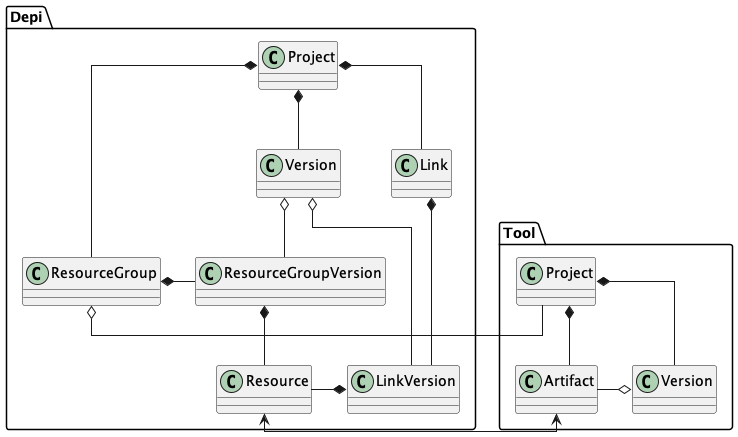

# Design of the DEPI dependency database

## Purpose

The DEPI provides a way to identify dependencies across applications that are managed
in various ways. For instance, a model in WebGME may contain items that are linked
to source code files stored in a Git repository. A link between resources may span
more than two resources across multiple applications.

The reason the DEPI exists is so that assurance cases that rely on various resources that
depend on other resources can be sure that all those resources are in sync. A common issue
is that an assurance case may rely on test case results, and those test case results may be
generated by one or more resources. If the resources have changed, but the test case results
have not been updated, then the assurance case may now be invalid.

When resources are linked together, there are various things that must take
place:

1. If any of the resources are renamed, the link should not be broken
2. If any of the resources are deleted, that resource in the link should be marked as being dead
3. If any of the resources are changed, the other resources in the link should be marked as dirty, meaning they need to be examined for any required changes.

## Usage

Users need to be able to link resources together in the DEPI. Either the DEPI could provide
this capability, or the individual tools could. Either way, the DEPI should contain an API that
allows for resources to be linked and unlinked, and also for links to be queried for dirty resources.

In addition, the DEPI needs to know when the underlying resources change, so that it can determine
when a link contains dirty items. Since different applications store their resources different ways, the
best way to facilitate this is for the DEPI to have an API that allows the applications to specify which
items have been added/changed/renamed/deleted and then the DEPI can update its links accordingly.

## Design

### Terminology

In some ways, the DEPI is providing a form of version control or version tracking on top of other
applications that likely also provide their own versioning. This means there will likely be
collisions of terminology, so for the purpose of the design and implementation of the DEPI, this
is how things are named.

#### Resource

A _resource_ is some kind of named item that can be linked to other resources within the DEPI. Each
resource is owned by a _resource group_. Each resource must have some kind of unique name that
can be used to identify it within its _resource group_ so that changes to resources can be tracked within
the DEPI. The DEPI does not care about the contents of a resource, it only needs a unique ID for
each resource that is understandable to the user.

#### Resource Group

A _resource group_ represents some externally-managed group of resources, such as a WebGME project, or
a Git repo. A _resource group_ owns a collection of resources.

#### Resource Group Version

A _resource group version_ represents one version of a _resource group_.

#### Resource Link

A _resource link_ represents a connection between _resources_ in one or more _resource groups_. The
DEPI doesn't have any notion of what the connection means, just that it represents some kind of dependency
in which the changes in one _resource_ mean that there may or may not be changes required in the
other resources contained in the link.

### Resource Link Version

A _resource link version_ represents one version of a _resource link_.

#### Project

A _project_ is a top-level item in the DEPI. The idea here is that some combination of _resources_
spanning multiple _resource groups_ are all being linked on behalf of some overall project (e.g. an implementation
of an ROV). A project can contain any number of _resource groups_ and can link together two or
more resources from different (or the same) _resource groups_.

#### Project Version

One of the difficulties the DEPI has is that it is trying to link together _resources_ that are
stored in various ways, under different types of versioning systems. Whenever any _resources_ change in the DEPI
or links are added/removed, that results in a new _project version_. Now, a particular _resource group_ may not
change for a long time, while other _resource groups_ in the DEPI change frequently. For example, there may be many
changes to source code files that implement a particular model without the model changing. This suggests that a particular
version of a _resource group_ may be a part of many versions in the DEPI.

#### Project structure

A _project_ has 0..n _versions_, and each _version_ has 0..n _resource groups_
and also 0..n _links_. A _resource group_ has 0..n _resources_, and a link has
0..n _resources_ (or at least references to resources). The structure would almost
be a tree, except that the _links_ connect what would otherwise be leaves.

The relationships between the items is shown here:

### API

There are two parts to the API, one for managing links between resources, including queries, and the other for
managing the resource groups (add/remove/update).

The DEPI has the concept of user sessions and can keep track of multiple
projects and versions for a given user. There is current version that
the user is working with during that session and all operations are performed on the current
version.

`login(string username, string password)`
Logs a user into the DEPI and if there was a current version from
the last login, sets the current version to that version.

`createProject(string projectId, string desc)`
Creates a new project with the given Id and description, and switches
the current version to a new version of this project.

`checkOutVersion(string projectId, string version)`
Checks out a specific version of a project and sets it to be the
current version in the session.

`checkOutBranch(string projectId, string branchId)`
Checks out the head of a specific branch of a project and sets it
to be the current version.

`createBranch(string branchId)`
Creates a new branch from the current version of the session.

`commitVersion(string comment)`
Commits the current version.

`findResourceGroupVersion(resourceGroupId, version)`
Looks to see if the DEPI already contains a specific version of
a resource group

`createResourceGroupVersion(resourceGroupId, version, resource[])`
Adds a new version of a resource group to the current version, replacing
an existing one with that resource id if necessary.

`addResourceGroupVersion(resourceGroupId, version)`
Adds an existing resource group to the current version, replacing
an existing one with that resource id if necessary.

`deleteResourceGroup(projectId)`
Deletes a resource group from the current version

`getResources(resourceGroupId)`
Retrieves a list of the available resources from a resource group

`addLink(linkId, resourceId[])`
Creates a new link with the named resources

`updateLink(linkId, resourceId[])`
Updates the list of resources in a link

`deleteLink(linkId)`
Deletes a link

`getDirtyLinks(linkId)`
Retrieves a list of the dirty links

`markResourceClean(linkId, resourceId)`
Marks a dirty resource in a link as clean

While it would be possible to do the above API with just a REST API,
the following watch capabilities require two-way communication. This could
be accomplished via websockets if the DEPI is using web protocols for
clients, or with 0MQ.

`addWatch(watch)`
Adds a watch for updates to project versions and/or resource group versions.

`cancelAllWatches()`
Cancels all watches

`cancelWatch(watch)`
Cancels a specific watch

`watchUpdate(update)`
Delivers an update notification about a watched project or resource
group to the client (this is not a request from the DEPI, but a
notification sent by it).

#### Typical Usage

##### New Project

A user creates a project. It is probably common that the resource groups
that will belong to the project already exist. The user checks out a version
of the project and then adds resource groups to it. The process of adding
a resource group will require some automation that tells the DEPI about
the resources that belong to that resource group. For instance WebGME might
need a plugin that can do that, and perhaps a Python script that uses the
Git API to do that for Git projects.

The user can also then add links between resources. The current assumption
is that the DEPI needs to know about a resource in order to add links,
and if that is the case, the mechanism to add links can provide various
search capabilities since the DEPI will know what resource groups are available
and what resources they contain.

Once everything has been added, the version is committed.

##### Updating an Existing Project

To update a project, the user can check out a version, possibly a specific branch.
Then the user can add or remove resource groups and/or links. Once the
changes have been made, the user commits the version, and that version
becomes the new head on whatever branch it was checked out on (or if
it is a new branch).

During this update process, the DEPI will also perform checks to look for
broken links, or renamed resources.

##### Checking Dirty Links

When a user updates an existing project, any links that contain resources
that have changed as part of this update will mark that their unchanged
resources are now dirty. It is assumed that if two resources are changed
during a commit that are linked to one another, that they have already
been updated and are not dirty.

Each application will have some way to query the DEPI for dirty links,
or this will be available within VS Code. You should be able to run a
check for dirty links in your project and then visit the resources that
are now dirty, as well as the ones that were changed. It is unclear whether
it will be feasible to show the user what changed that caused the link
to be dirty.

### Versioning

There needs to be a two-step phase when it comes to creating DEPI versions based on the
versions in the individual projects. With applications like Git, there isn't a new version until
changes have been committed. Because of this, we need for changes to be committed to a
repository before the changes can be loaded into DEPI.

To create a new version of a project in the DEPI then, you check out an existing version,
update the versions of any resource groups that have changed (e.g. for a new version of
a Git repo, you give DEPI a list of the changes so it can update links accordingly), and
also update the existing links. Once that is done, you commit the new DEPI version.

The DEPI allows versions to be branched, and then a commit commits to the head of the branch
that it was checked out from.

## Storage#

We have been discussing the use of a graph database for the DEPI storage, but the storage for
the DEPI might actually be suited for a relational database.
